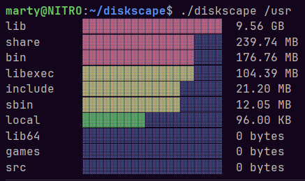

# diskscape

`diskscape` is a small terminal utility written in C that visualizes disk usage for a selected directory.

It scans the given path and displays files and directories as colorful ASCII bar charts, making it easier to quickly see which entries take up the most space.

## Features

- scans disk usage for a given path,
- displays results using colored ASCII bars,
- sorts entries by size from largest to smallest,
- supports limiting the number of displayed entries,
- supports hiding empty entries,
- prints human-readable file sizes.

## Example output


## Requirements

This project is intended for Linux systems.

To build the project, you need:

- a C compiler with C11 support,
- CMake 3.28 or newer.

## Building

```
gcc -o diskscape main.c diskscape.c -lm
```
## Running 
After building the project, run:
```
./diskscape <path>
```

This will scan the current directory and display its contents sorted by size.

## Flags

The following flags are available:

### `--top <N>`

Limits the output to the top `N` largest entries.

Example:
```
./diskscape . --top 5
```
### `--hide-empty`

Hides entries that take no disk space.

Example:
```
./diskscape . --hide-empty
````

Flags can also be combined:

```
./diskscape . --top 10 --hide-empty
```


## Notes

`diskscape` skips hidden files and directories.

The displayed sizes are calculated from regular files and directories found inside the provided path.

Results may differ slightly from other disk usage tools depending on how symbolic links, filesystem metadata, or hidden entries are handled.

